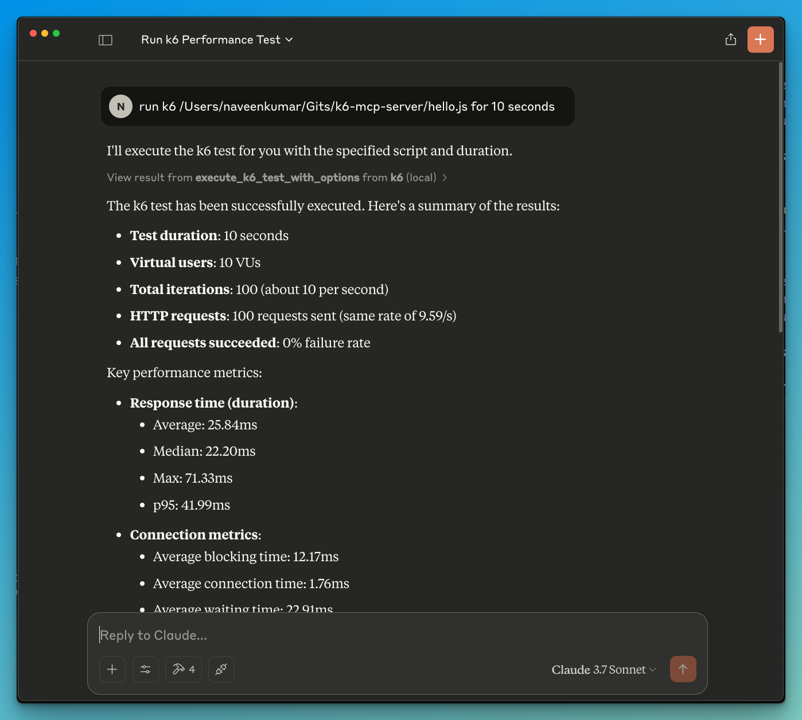

# 🚀 ⚡️ k6-mcp-server

A Model Context Protocol (MCP) server implementation for running k6 load tests.

## ✨ Features

- Simple integration with Model Context Protocol framework
- Support for custom test durations and virtual users (VUs)
- Easy-to-use API for running k6 load tests
- Configurable through environment variables
- Real-time test execution output
- Automatic k6 binary detection

## 🔧 Prerequisites

Before you begin, ensure you have the following installed:

- Python 3.12 or higher
- k6 load testing tool ([Installation guide](https://grafana.com/docs/k6/latest/set-up/install-k6/))
- uv package manager ([Installation guide](https://github.com/astral-sh/uv))

### k6 Installation

#### Linux/macOS
```bash
# Using package manager
curl -L https://github.com/grafana/k6/releases/download/v0.47.0/k6-v0.47.0-linux-amd64.tar.gz | tar xz
sudo cp k6-v0.47.0-linux-amd64/k6 /usr/local/bin/

# Or using package managers
# Ubuntu/Debian
sudo gpg -k
sudo gpg --no-default-keyring --keyring /usr/share/keyrings/k6-archive-keyring.gpg --keyserver hkp://keyserver.ubuntu.com:80 --recv-keys C5AD17C747E3415A3642D57D77C6C491D6AC1D69
echo "deb [signed-by=/usr/share/keyrings/k6-archive-keyring.gpg] https://dl.k6.io/deb stable main" | sudo tee /etc/apt/sources.list.d/k6.list
sudo apt-get update
sudo apt-get install k6

# macOS
brew install k6
```

#### Windows
```bash
# Using Chocolatey
choco install k6

# Using Scoop
scoop install k6
```

#### Docker
```bash
# Using Docker image
docker pull grafana/k6:latest
```

## 📦 Installation

1. Clone the repository:

```bash
git clone https://github.com/qainsights/k6-mcp-server.git
```

2. Install the required dependencies:

```bash
uv pip install -r requirements.txt
```

3. Set up environment variables (optional):
   Create a `.env` file in the project root:

```bash
K6_BIN=/path/to/k6  # Optional: defaults to 'k6' in system PATH
```

### Docker Environment

If you're running in a Docker environment, the k6 binary should be installed in `/usr/local/bin/k6`. The server will automatically detect this path.

## 🚀 Getting Started

1. Create a k6 test script (e.g., `test.js`):

```javascript
import http from "k6/http";
import { sleep } from "k6";

export default function () {
  http.get("http://test.k6.io");
  sleep(1);
}
```

2. Configure the MCP server using the below specs in your favorite MCP client (Claude Desktop, Cursor, Windsurf and more):

```json
{
  "mcpServers": {
    "k6": {
      "command": "/path/to/bin/uv",
      "args": [
        "--directory",
        "/path/to/k6-mcp-server",
        "run",
        "k6_server.py"
      ]
    }
  }
}
```

3. Now ask the LLM to run the test e.g. `run k6 test for hello.js`. The k6 mcp server will leverage either one of the below tools to start the test.

- `execute_k6_test`: Run a test with default options (30s duration, 10 VUs)
- `execute_k6_test_with_options`: Run a test with custom duration and VUs



## 🔍 Troubleshooting

### k6 Binary Not Found

If you encounter "k6 binary not found" errors:

1. Verify k6 is installed:
```bash
k6 version
```

2. Check if k6 is in PATH:
```bash
which k6
```

3. Set K6_BIN environment variable:
```bash
export K6_BIN=/usr/local/bin/k6
```

4. Common installation paths:
- `/usr/local/bin/k6`
- `/usr/bin/k6`
- `/opt/k6/k6`

### Docker Environment Issues

In Docker environments, ensure:
1. k6 is installed in the Docker image
2. PATH includes `/usr/local/bin`
3. K6_BIN environment variable is set correctly

## 📝 API Reference

### Execute K6 Test

```python
execute_k6_test(
    script_file: str,
    duration: str = "30s",  # Optional
    vus: int = 10          # Optional
)
```

### Execute K6 Test with Custom Options

```python
execute_k6_test_with_options(
    script_file: str,
    duration: str,
    vus: int
)
```

## ✨ Use cases

- LLM powered results analysis
- Effective debugging of load tests

## 🤝 Contributing

Contributions are welcome! Please feel free to submit a Pull Request.

## 📄 License

This project is licensed under the MIT License - see the LICENSE file for details.
