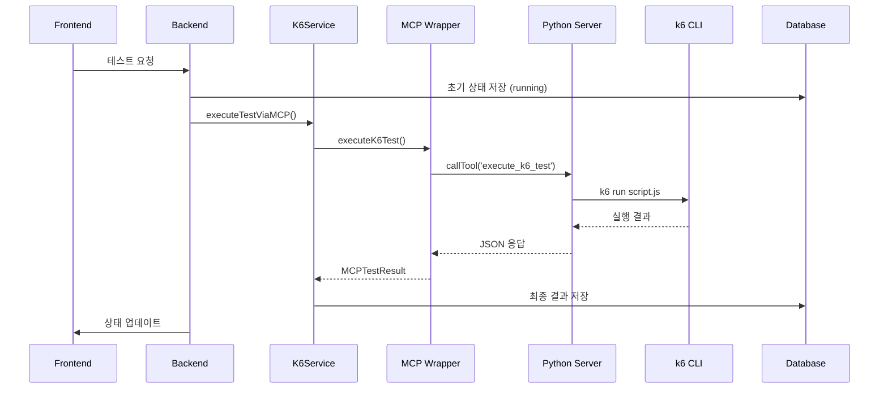
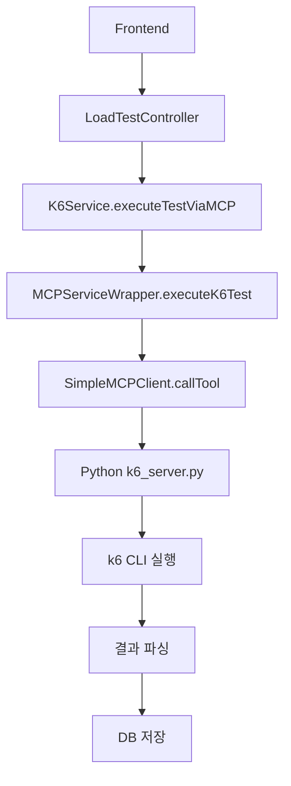
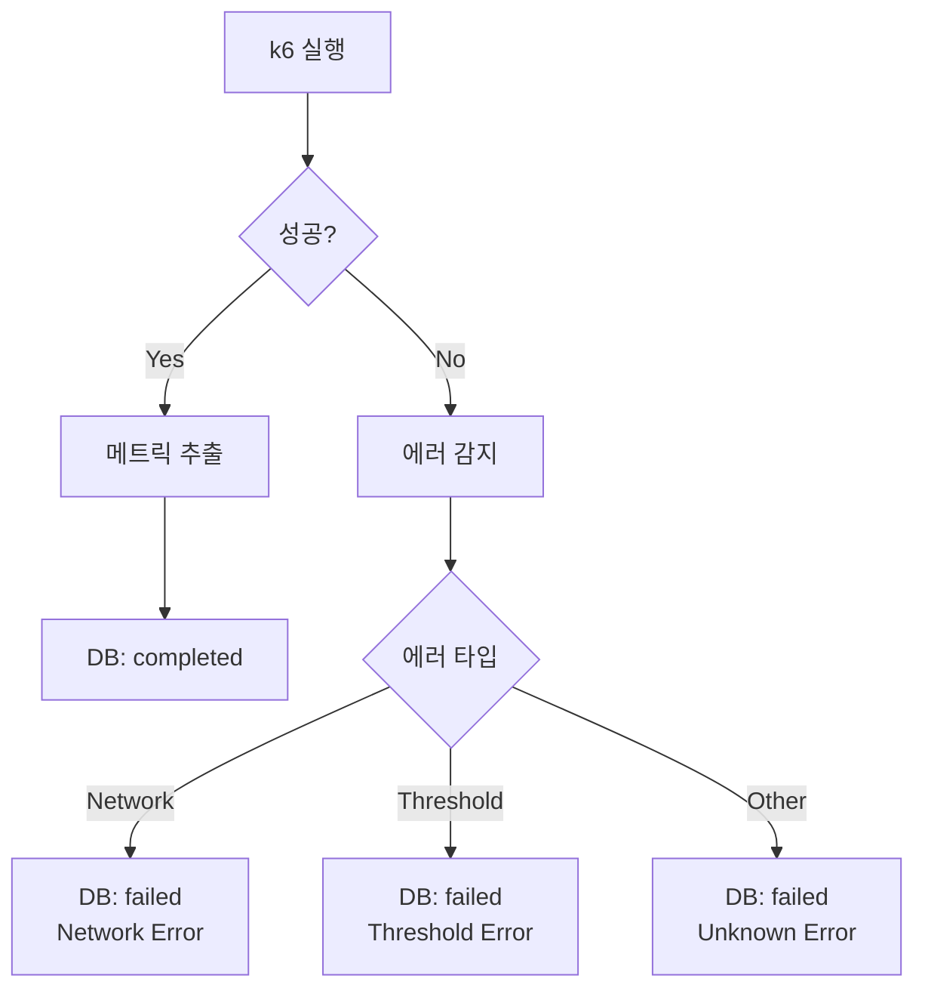

# k6 MCP 호출 흐름 (단순화)

## 기본 흐름


## 상세 단계



## 핵심 컴포넌트



## 에러 처리 흐름



## 실제 호출 예시

```
1. Frontend → POST /api/load-tests
2. Backend → K6Service.executeTestViaMCP()
3. K6Service → MCPServiceWrapper.executeK6Test()
4. MCP Wrapper → SimpleMCPClient.callTool()
5. SimpleMCPClient → Python k6_server.py
6. Python Server → k6 run script.js
7. k6 → 실행 결과 반환
8. Python Server → JSON 응답
9. MCP Wrapper → 결과 파싱
10. K6Service → DB 저장
11. Backend → Frontend 상태 업데이트
``` 