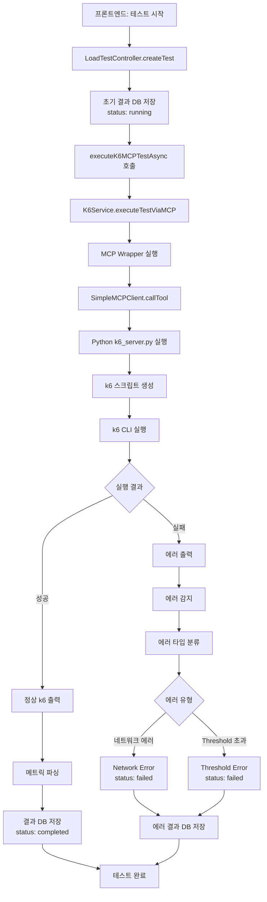
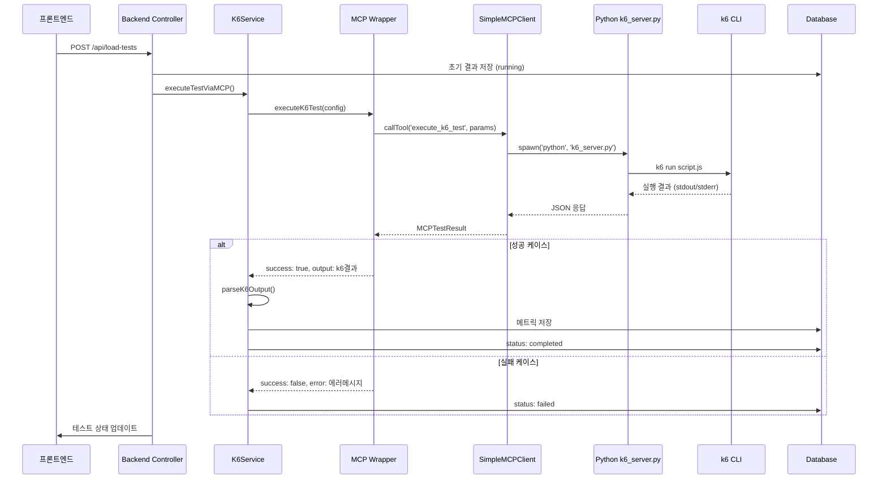
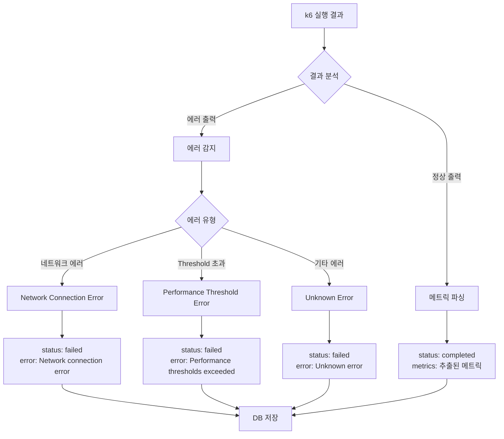

# k6 MCP 테스트 실행 흐름도

## 전체 테스트 흐름

## 상세 MCP 통신 흐름

## 에러 처리 흐름

## 실제 실행된 테스트 분석

### 테스트 정보
- **URL**: `https://dev.mobigen.com/safezone`
- **Duration**: 10초
- **VUs**: 1000
- **Preset**: high

### 실행 결과
1. **MCP 서버 호출**: ✅ 성공
2. **k6 스크립트 생성**: ✅ 성공
3. **k6 실행**: ❌ 실패
4. **에러 유형**: Threshold 초과
5. **최종 상태**: `completed` (잘못된 처리)

### 문제점
- Threshold 에러가 발생했지만 `completed`로 처리됨
- 수정된 에러 처리 로직이 적용되지 않음

### 개선 사항
- Threshold 에러 시 `failed` 상태로 처리
- 구체적인 에러 메시지 제공
- 에러 유형별 분류 처리 