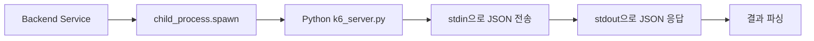
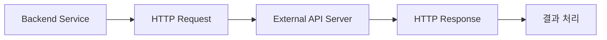
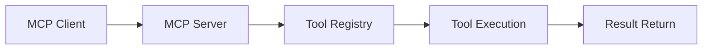

# MCP 방식 vs API 방식 비교

## 현재 구현된 "MCP 방식" (실제로는 API 호출)

### 통신 방식


### 실제 구현
```javascript
// SimpleMCPClient.callTool()
const childProcess = spawn('python', [this.serverPath]);
childProcess.stdin.write(JSON.stringify(request) + '\n');
childProcess.stdin.end();

childProcess.stdout.on('data', (data) => {
  output += data.toString();
});
```

### 특징
- **프로세스 간 통신**: `child_process.spawn` 사용
- **JSON 기반**: stdin/stdout으로 JSON 주고받기
- **동기적 실행**: 프로세스가 완료될 때까지 대기
- **로컬 실행**: 같은 서버에서 Python 스크립트 실행

## 일반적인 API 방식

### 통신 방식


### 실제 구현 예시
```javascript
// API 호출 방식
const response = await fetch('http://k6-api-server:3000/execute', {
  method: 'POST',
  headers: { 'Content-Type': 'application/json' },
  body: JSON.stringify({ script, duration, vus })
});
```

### 특징
- **HTTP 통신**: RESTful API 호출
- **네트워크 기반**: TCP/IP 통신
- **비동기적**: HTTP 요청/응답
- **원격 실행**: 별도 서버에서 실행

## 진정한 MCP 방식

### 표준 MCP 프로토콜


### 실제 MCP SDK 사용
```javascript
// 진정한 MCP 클라이언트
import { MCPClient } from '@modelcontextprotocol/sdk/client';

const client = new MCPClient();
await client.connect('ws://localhost:3000');
const result = await client.callTool('execute_k6_test', params);
```

## 비교 분석

| 구분 | 현재 "MCP" 방식 | 일반 API 방식 | 진정한 MCP 방식 |
|------|----------------|---------------|-----------------|
| **통신 프로토콜** | stdin/stdout JSON | HTTP REST | WebSocket/HTTP |
| **실행 환경** | 로컬 프로세스 | 원격 서버 | MCP 서버 |
| **의존성** | Python 스크립트 | HTTP API | MCP SDK |
| **확장성** | 제한적 | 높음 | 높음 |
| **표준화** | 커스텀 | REST 표준 | MCP 표준 |
| **에러 처리** | 프로세스 에러 | HTTP 에러 | MCP 에러 |

## 현재 구현의 문제점

### 1. **진정한 MCP가 아님**
```javascript
// 현재: 단순한 프로세스 실행
spawn('python', ['k6_server.py'])

// 진정한 MCP: 표준 프로토콜
MCPClient.callTool('execute_k6_test', params)
```

### 2. **확장성 제한**
- 로컬에서만 실행 가능
- 프로세스 관리 복잡
- 에러 처리 한계

### 3. **표준화 부족**
- 커스텀 JSON 프로토콜
- MCP 표준 미준수
- 호환성 문제

## 개선 방향

### 1. **진정한 MCP 구현**
```javascript
// MCP 서버 구현
import { Server } from '@modelcontextprotocol/sdk/server';

const server = new Server({
  name: 'k6-mcp-server',
  version: '1.0.0'
});

server.setRequestHandler('execute_k6_test', async (params) => {
  // k6 실행 로직
  return { result: k6Output };
});
```

### 2. **API 방식으로 전환**
```javascript
// 별도 k6 API 서버
const k6ApiServer = express();
k6ApiServer.post('/execute', async (req, res) => {
  const result = await executeK6Test(req.body);
  res.json(result);
});
```

### 3. **하이브리드 방식**
```javascript
// MCP 표준 + API 호출
const mcpClient = new MCPClient();
await mcpClient.callTool('execute_k6_test', {
  apiEndpoint: 'http://k6-api-server:3000',
  params: { script, duration, vus }
});
```

## 결론

현재 구현은 **"MCP"라고 부르지만 실제로는 API 호출 방식**입니다:

- ✅ **장점**: 간단한 구현, 로컬 실행
- ❌ **단점**: 진정한 MCP 아님, 확장성 제한

**진정한 MCP 구현**을 위해서는:
1. MCP SDK 사용
2. 표준 프로토콜 준수
3. WebSocket/HTTP 통신
4. Tool Registry 구현 